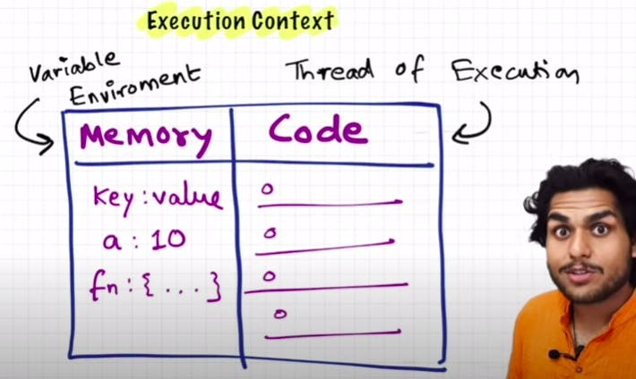

# How JavaScript Works?

> Is JavaScript:
>
> - **_Synchronous_** or Asynchronous?
> - **_Single-threaded_** or Multi-threaded?

---

## ✅ JavaScript is a Synchronous, Single-threaded Language

### 🧠 What Does “Synchronous and Single-threaded” Mean?

---

## 🔹 1. Single-threaded

- JavaScript has **one main thread** to execute code.
- It can **only do one thing at a time**.
- It uses a **single Call Stack**, and instructions are executed **line by line**, in the **order** they appear.

---

## 🔹 2. Synchronous

- In a synchronous language, tasks are executed **sequentially** (one after another).
- JavaScript **waits** for the current task to finish **before** moving to the next.
- This means long-running tasks (like a big loop or complex calculation) will **block the entire thread**.

---

---

# 🧠 What is an Execution Context?

Everything in JavaScript happens inside an **Execution Context**.

You can imagine this _Execution Context_ as a **big box or container** where the entire JavaScript code runs.

### 🔸 This box has two main components:

1. ### 🧠 Memory Creation Phase (Variable Environment)
   - All **variables and functions** are stored as **key-value pairs**.
   - This phase prepares memory and is also known as the **Variable Environment**.

2. ### 🧠 Code Execution Phase (Thread of Execution)
   - This is where **code is executed line by line**.
   - This is called the **Thread of Execution**.

---

## 🔁 Summary

- JavaScript is a **_synchronous single-threaded_** language.
- **Single-threaded** ➝ Executes **one command at a time**.
- **Synchronous** ➝ Executes code **in a specific order**, waiting for the current task to finish before moving to the next.

