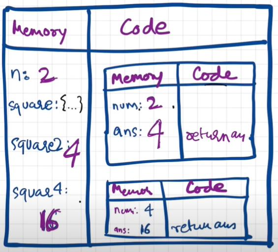

---

### How JavaScript Code is executed?

**What happens when you run JavaScript code?**

> _An <mark>**Execution Context**</mark> is created._

- When a JS program is ran, a global execution context is created.

- The execution context is created in two phases.

   - Memory creation phase - JS will allocate memory to variables and functions.
   - Code execution phase
Let's consider the below example and its code execution steps:

```js
var n = 2;
function square(num) {
  var ans = num * num;
  return ans;
}
var square2 = square(n);
var square4 = square(4);
```

- When the above code is executed, an **Execution Context** is created
  - This **Execution Context** is created in 2 phases:
    - **Creation:** The **Creation Phase** is also known as the **Memory Creation Phase**. This is a very critical phase.
    
      - In the first phase of _memory creation_, JavaScript will allocate memory to all the variables and functions.
      - As soon as JavaScript encounters `var n = 2;`, it allocates memory to `n`.
      - On encountering the function `square(num)`, it allocates memory to this function (`square`) as well.
      - When it allocates memory to `n`, it stores a special value called `undefined`. `undefined` is treated like a special placeholder in JavaScript.
      - In case of the function `square(num)`, it stores the entire code of this function in the memory space.
      - It will also allocate memory to `square2` and `square4` and store `undefined` for both.
      - In order to complete this **Creation** phase, JavaScript goes through the code, line by line, top to bottom.
    - **Code Execution:**

     
      - Now JavaScript once again runs through this whole program line by line.
      - When it encounters `var n = 2;`, it actually places `2` as a value for `n` in the **Memory Component**.
      - When it encounters the function definition of `square(num)`, it has nothing to execute, so JavaScript simply passes through.
      - When it encounters `var square2 = square(n);`, we are now invoking a function.
      - Functions are the heart of JavaScript. They behave very differently in JavaScript than in any other language.
      - Whenever a function is invoked, an all together new **Function Execution Context** is created.
      - So, technically, a brand new **Execution Context** is created inside the **Code Component** of the overall **Execution Context**.
      - This new **inner Execution Context** also has its own **Memory Component** and the **Code Component**.
      - What happens in the **innner** one now is:
        - We have 2 variables in this case, namely `num` (which is the parameter) and `ans`.
        - So memory will be allocated to `num` and `ans`.
        - In phase 1, alike the overall Execution Context, `undefined` will be assigned to `num` and `ans`.
        - Now coming to phase 2 (code execution phase), the value of the argument is assigned to the parameter. So, in the statement `var square2 = square(n);` where we are invoking a function, we're passing the argument `n` to the function `square(num)` and the value of this argument replaces the placeholder `undefined` in the **Memory Component** of the **inner Execution Context**.
        - After calculation of `num * num`, the value is stored in `ans`.
        - On encountering `return ans;`, the value stored in `ans` is returned to the invoked location and this **inner Execution Context** ends. When it ends, it actually gets deleted.
         
      - Now, the same process is followed when the line `var square4 = square(4);` is encountered.
      - After successful execution of the last line, the **overall Execution Context** also gets deleted. This _'overall'_ execution context is also termed as the **Global Execution Context**.

> Now, how does JavaScript manage this _'chaining'_ of **Execution Contexts**?

- It actually manages a stack under the hood.
- This stack is also termed as the **Call Stack**.
- The **GEC** (Global Execution Context) is always at the bottom of this stack.
- Whenever a new Execution Context is created, it is pushed in this stack and on completion of its purpose, it gets popped.
- The control stays with the topmost element of this _Call Stack_.
- This _Call Stack_ is only used to manage the **Execution Context(s)**.
- On successful execution of the last statement, the **Call Stack** is emptied.

> **Call Stack** maintains the <mark>**_order of execution_**</mark> of Execution Contexts.

The **Call Stack** has the following fancy names by which it is also referred:

- Execution Context Stack
- Program Stack
- Control Stack
- Runtime Stack
- Machine Stack

---