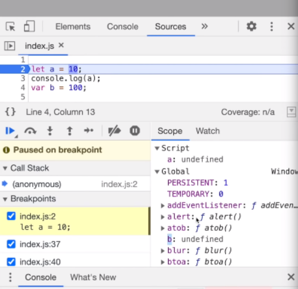

### `let` and `const` in JS - Temporal Dead Zone

- **What is a Temporal Dead Zone?**
- **Are `let` & `const` declarations hoisted?**
- **SyntaxError vs. ReferenceError vs. TypeError**

### Hoisting in JavaScript: `let`, `const`, and `var`

- `let` and `const` declarations are **hoisted**.
  - However, they are hoisted **differently** compared to `var`.

---

## Temporal Dead Zone (TDZ)

- Variables declared with `let` and `const` are placed in a **Temporal Dead Zone (TDZ)** from the start of the block until the declaration is encountered.
- Accessing the variable **before declaration** results in a **ReferenceError**.
- The TDZ ensures that variables cannot be accessed **before they are declared**.

---

## Key Differences

- `var`:
  - Hoisted and initialized with `undefined`.
  - Can be accessed before declaration (but will be `undefined`).

- `let` and `const`:
  - Hoisted, but **not initialized**.
  - Remain **uninitialized** in the TDZ.
  - Accessing them before declaration causes an **error**.

---

## Example

```js
console.log(a); // undefined
var a = 10;

console.log(b); // ReferenceError: Cannot access 'b' before initialization
let b = 20;
```

Sample code:

```js
console.log(b);
let a = 10;
var b = 100;
```

Sample output:

```
undefined
```

Sample code:

```js
console.log(a);
let a = 10;
var b = 100;
```

In the above code, we'll face the following issue:

```
Uncaught ReferenceError: Cannot access 'a' before initialization at ...
```

So, according to the above error, we can only access `a` after we've initialized it. But, _how to know whether this variable was hoisted or not?_

Let's go into the developer tools and check for ourselves what's going on.



As shown in the above screenshot, we can see that JavaScript has allocated memory to `a` in the `Script` section, but for `b` it has done the same in the `Global` section. Now the question arises is, _what is this `Script`?_

Memory was assigned to `b`, to the `var` declaration, and it was attached to the global object. But, in case of `let` and `const`, they are also allocated memory, which is what we call as **Hoisting**. But, the difference is that `let` and `const` declarations are stored in a different memory space than global, and we cannot access them unless they are assigned a value. This is how **Hoisting** works in case of `let` and `const` declarations.

In case of the above code, in which the execution is paused using a debugger, even if we run the entire script, the `let` and `const` declarations with still remain in the `Script` section of the memory. The point to consider is whether we'll be able to access them or not. Well, we'll be able to access only when a value is assigned to them.
# Script vs Global in JavaScript DevTools (Hoisting of `var`, `let`, and `const`)

- **What is “Script”?**
  - In browser DevTools, **Global** shows properties on the **global object** (e.g., `window`).
  - **Script** shows bindings in the **global lexical environment** (the script scope), which is separate from the global object.
  - In short:  
    - `Global` ⇒ global object properties.  
    - `Script` ⇒ lexical bindings created at the top level of the script.

---

## How `var`, `let`, and `const` appear

- **`var`**
  - Hoisted **and initialized to `undefined`**.
  - Declaring `var b` at the top level **creates a property on the global object** (`window.b` in browsers).
  - Hence, `b` appears under the **Global** section.

- **`let` and `const`**
  - Hoisted **but not initialized** (they are in the **Temporal Dead Zone** until the declaration is executed).
  - Top‑level `let`/`const` create **lexical bindings** in the **Script** environment, **not** properties on the global object.
  - Therefore, they appear under the **Script** section.

---

## Access and the Temporal Dead Zone (TDZ)

- While execution is paused (e.g., at a breakpoint), `let`/`const` are visible under **Script** but:
  - **Cannot be accessed** before their declaration line runs (TDZ ⇒ `ReferenceError` if accessed early).
  - **Become accessible only after initialization**:
    - `let` can be declared first and assigned later; it’s accessible **after** the declaration executes.
    - `const` **must be initialized at declaration**; it’s accessible **after** that line executes.

---

## DevTools observation

- Even after the script finishes running:
  - `var` declarations remain visible under **Global** (as global object properties).
  - `let`/`const` remain visible under **Script** (as lexical bindings), not under Global.
  - The key point is **accessibility timing**:
    - They’re listed in **Script** due to hoisting,
    - But you can **only use them after** their initialization (post‑TDZ).

---

## Key takeaways

- `var` ⇒ global object property, hoisted & initialized to `undefined` → appears in **Global**.  
- `let`/`const` ⇒ script‑scope lexical bindings, hoisted but uninitialized (TDZ) → appear in **Script**.  
- You can only access `let`/`const` **after** their declaration (and initialization for `const`).


**What is a Temporal Dead Zone?**

- The **Temporal Dead Zone (TDZ)** is the time interval between:
  - When a variable is **declared** (`let` or `const`), and
  - When it is **initialized** with a value.
- During the TDZ, the variable **exists in memory**, but **cannot be accessed**.
- The TDZ ends the moment the variable is **assigned a value**.

Whenever we try to access a variable when it is in the **Temporal Dead Zone**, we get a `ReferenceError`.

Another type of `ReferenceError` is when we're trying to access something which is `not defined`.

- In case of `var` declarations, we can access the data members from the `window` object (in case of browsers).
-  But that is not the case for `let` and `const` declarations. If we try to do something like `this.a` or `window.a` in the global scope relative to the above code, we'll get `undefined` in return, which we get for anything which is absent as a key in the `window` object.

Sample Code:

```js
let a = 10;
let a = 100;
```

In case of the above code, we'll face the following issue:

```
Uncaught SyntaxError: Identifier 'a' has already been declared
```

So, this means that we're unable to do a re-declaration using `let`.

Also, in case of `SyntaxError`s, none of the statements of the code are executed.

For instance, the code below:

```js
console.log("something");
let a = 10;
let a = 100;
```

Will face the same `SyntaxError` situation and nothing will be executed.

This phenomena is also observed in the following code:

```js
let a = 10;
var a = 100;
```

But, the following code snippet is totally valid:

```js
var b = 100;
var b = 1000;
```

Now, coming to `const`. `const` behaves much more similar than how `let` behaves, but it is a little more stricter than `let`.

For instance, we can do a `let` declaration without initialization and initialize the same later. But, we're unable to do the same in case of a `const` declaration.

Sample code:

```js
const b;
```

We'll face the following issue in the above code:

```
Uncaught SyntaxError: Missing initializer in const declaration
```

This means that whenever we're going for a `const` declaration, it expects to get initialized in the same line.

Sample code:

```js
const b = 10;
b = 100;
```

We'll face the following issue in the above code snippet:

```
Uncaught TypeError: Assignment to constant variable ...
```

## Types of JavaScript Errors: `TypeError`, `SyntaxError`, `ReferenceError`

## 1. TypeError

- A **TypeError** occurs when a value is used in an **inappropriate way** for its data type.
- Example:
  - Trying to reassign a value to a `const` variable.
- Reason:
  - `const` variables are **constants** and **cannot be reassigned** after their initial assignment.

```js
const a = 10;
a = 20; // ❌ TypeError: Assignment to constant variable.
```
## 2. SyntaxError
- A SyntaxError is thrown when the JavaScript syntax rules are broken.

- These errors are detected during the parsing stage, before execution.

- Example:

     - Missing brackets, parentheses, or using reserved keywords improperly.

```
let if = 10; // ❌ SyntaxError: Unexpected token 'if'
```
## 3. ReferenceError
- A ReferenceError occurs when:

   - The engine tries to access a variable that doesn't exist or is inaccessible in the current scope.

- Common scenarios:

    - Using variables before declaration.

    - Accessing undeclared variables.

    - Accessing let/const variables inside the Temporal Dead Zone.

```
console.log(x); // ❌ ReferenceError: x is not defined
```
Now, according to certain conventions followed by the community, always use `const` wherever possible. This reduces the possibility of unexpected errors. If not `const` then we should use `let`, since due to the presence of the **Temporal Dead Zone**, we won't face unexpected errors.

Keep `var` aside. But, even if you ever feel the need to use `var`, use it very consciously. Otherwise, it is an un-preferred method of declaration.

Also, in an attempt to reduce issues being faced due to the **Temporal Dead Zone**, always try to put all the declarations and initializations at the top of the script. This technically shrinks the **Temporal Dead Zone** to zero.
